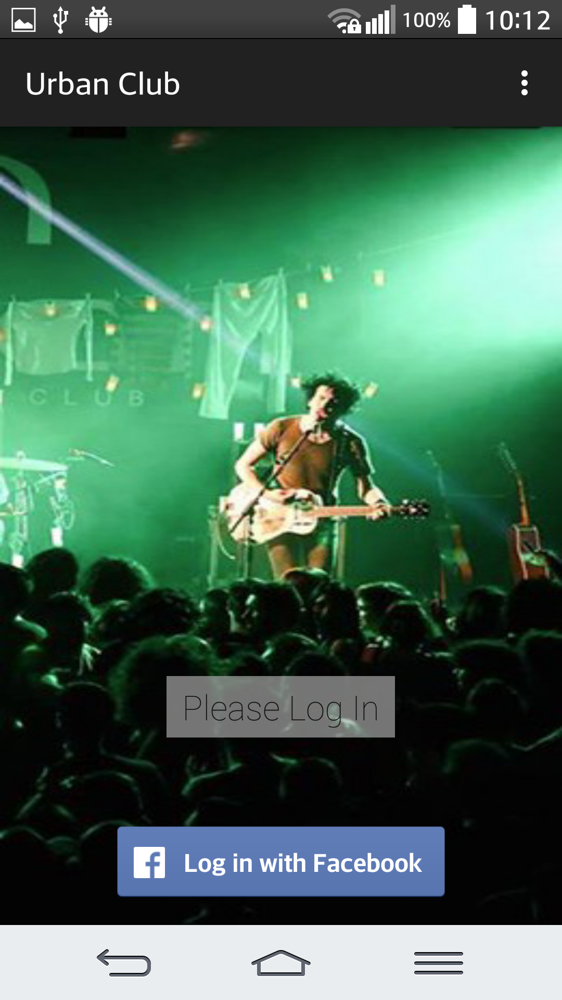
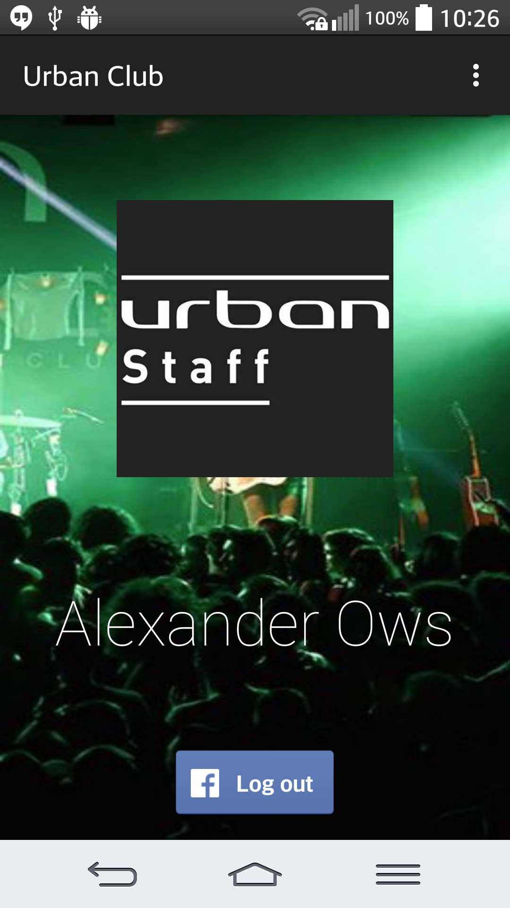
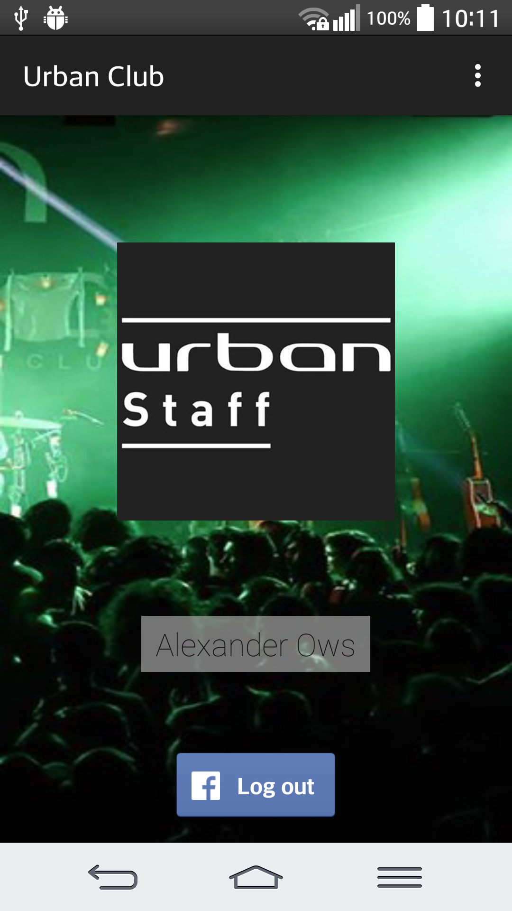
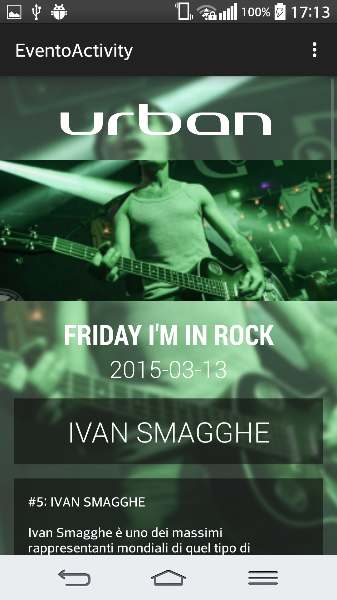
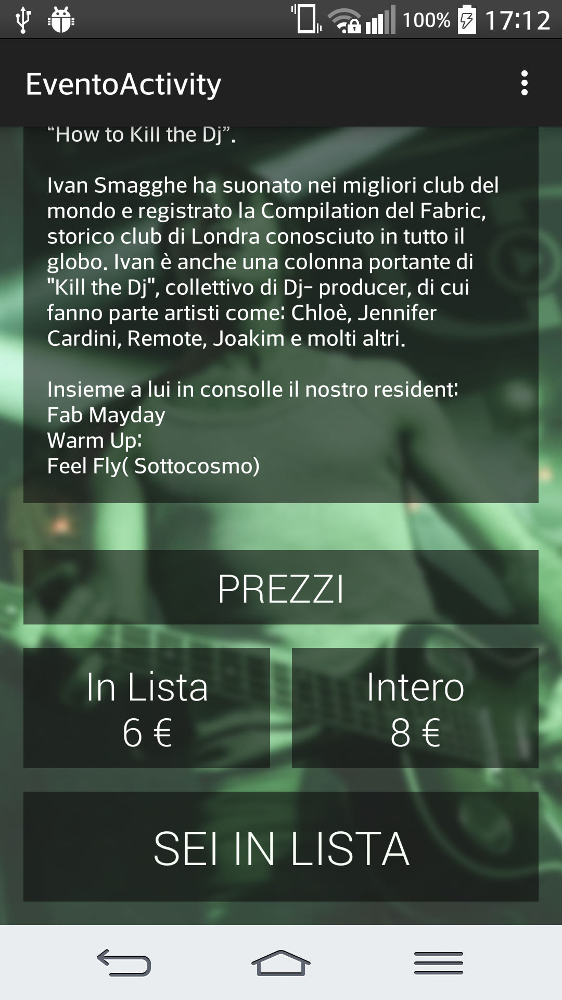
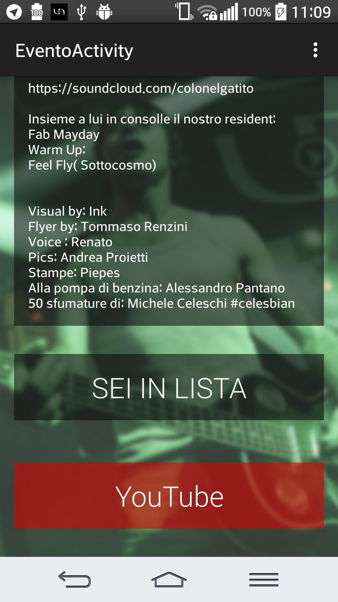
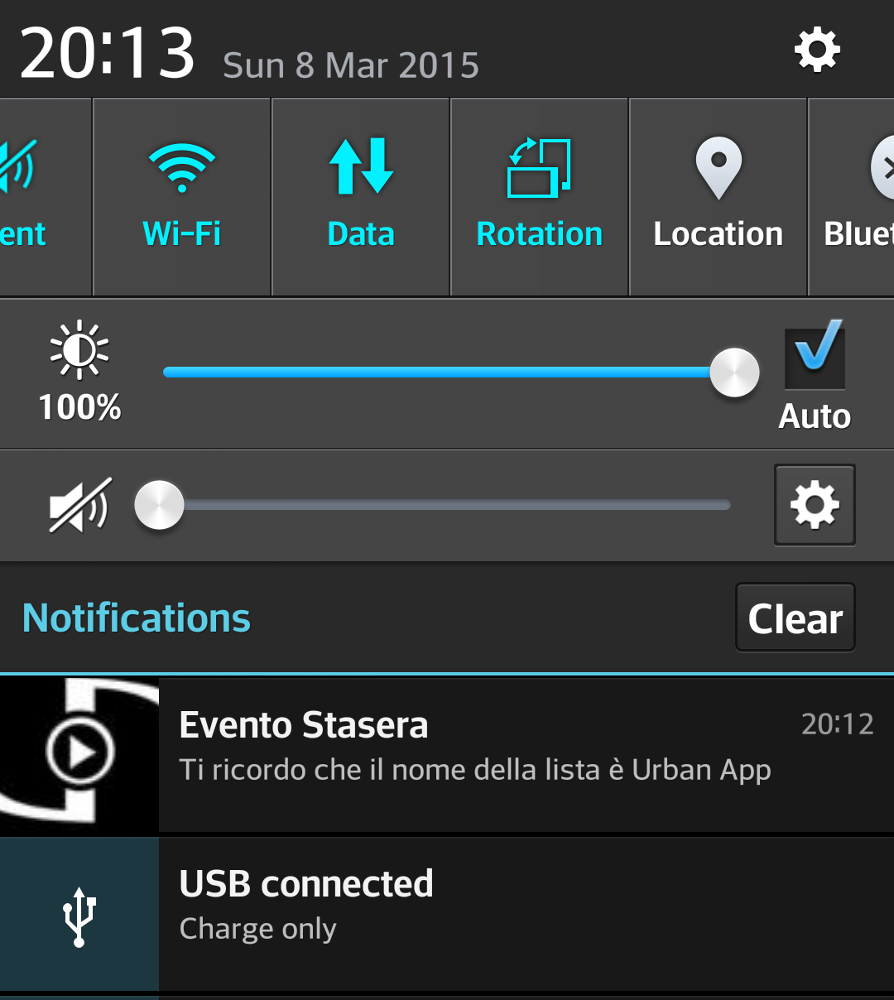
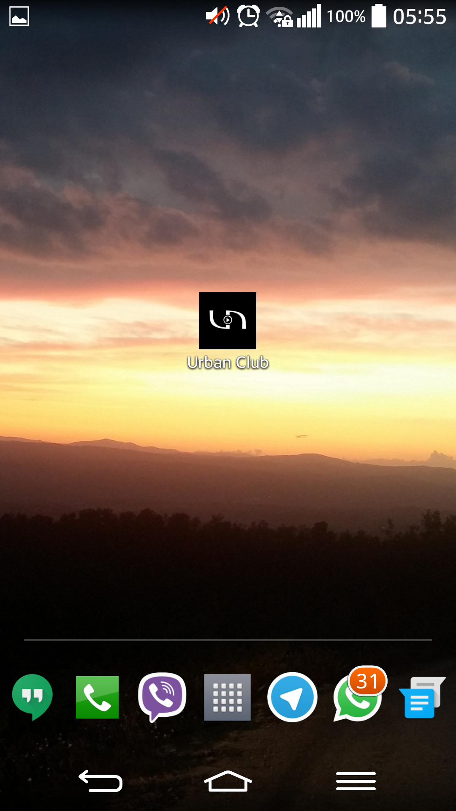

# ANDROID APPLICATION WORKING PROTO
This is an example of **Android application**, this application can be used as **prototype** for a Club, it keeps updated the user about future events, artist videos, prices and bus time schedules, using it can allow the final user to access a special list discount.  

**[HERE](https://github.com/sn1p3r46/urbanserver) you can find the REST server repository**  

## Conceptual Working Demo

The application uses the **Facebook Social Login** to identify the user, to get the events and user informations it interacts with a server developed in [Python2.7](https://www.python.org/) using the [DJango](https://www.djangoproject.com/) framework. ([Click Here](https://github.com/sn1p3r46/urbanserver) The server Repo)

#### Facebook Login Activity:

  

#### User Profile Logged-In

**Two different UIs:**

  
  

#### Event Activity:

Both the cover image and background should change for every event. The background one is the same of the cover but blurred.

  
  
  

#### Notification:

If the user has expressed its interest on a specific event the application will remind the user the day of the event with a notification.

  
  

#### Notes:

The application can not be launched as it is, in fact it needs some code review because is based on some Facebook API that now are deprecated.
